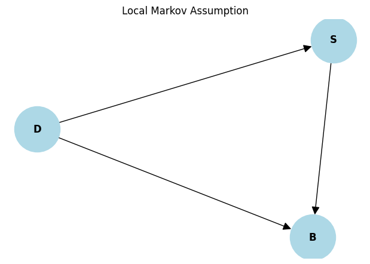

## Introduction

This is about the paper [Toward Falsifying Causal Graphs Using a Permutation-Based Test](https://arxiv.org/abs/2305.09565). This is a my notes on what question this paper aims to solve and how.

### Contents
- The problem statement
- Previous methods
- Why the baseline is not suitable
- The solution

## The Problem Statement

In causal inference when trying to understand the cause and effect from the observational data using the graphical causal model, it is necessary to constuct the DAGs. Sometimes we don't know the true DAGs, so to check if our proposed DAGs is a good assumption, we need to test it with the data available. That is we need some test to accept or refute DAGs. This paper proposes methodology to refute the graph, if the DAGs are not refuted by the test, it doesn't mean we it is true, it is just that the DAGs cannot be refuted by the data provided.

## Previous Methods

One of the popular ways to refute the DAGs is to perform the conditional independence test using HSIC, Generalized Covariance Measure etc. We check if Local Markov Condition(LMC) defined by the graphs are also satisfied by the data. What is LMC?

### Local Markov Condition (LMC)
Given Node X, its descendants D, and Parents PA. The LMC is
$$
X \perp D \mid PA
$$
Given its parents (PA) in the DAG, a node (X) - is independent of all its non-descendants (D).

#### Local Markov Assumption

The **Local Markov assumption** is a property of Bayesian networks. It states that:

> A node in a Bayesian network is conditionally independent of its non-descendants, given its parents.

In simpler terms, this means that once we know the value of a node's parent(s), the node provides no additional information about its non-descendants.

#### Example: Weather and Sprinkler Bayesian Network

Consider a Bayesian network with the following nodes:
- **Dark** (D): The room is dark.
- **Switch** (S): Light Bulb Switch, whether it is on of off.
- **Bulb** (B): Whether Bulb is glowing or not.

The graph structure is as follows:

- Dark → Switch
- Dark → Bulb
- Switch → Bulb

In this example:
- **Dark (D)** directly influences both **Switch (S)** and **Bulb (B)**.
- **Switch (S)** directly influences **Bulb (B)**.

The Local Markov assumption for this DAG is as follows:
- **Switch(S)** is conditionally independent of **Bulb (B)**, given **Dark (D)**.

#### DAG in Python

Below is an example using Python to demonstrate conditional independence based on the Local Markov assumption:

```python
import networkx as nx
import matplotlib.pyplot as plt

# Define the Bayesian network structure
G = nx.DiGraph()
G.add_edges_from([("D", "S"), ("D", "B"), ("S", "B")])

# Plot the Bayesian network
plt.figure(figsize=(6, 4))
nx.draw(G, with_labels=True, node_size=3000, node_color="lightblue", font_size=12, font_weight="bold", arrowsize=20)
plt.title("Local Markov Assumption")
plt.show()
```




#### LMC in Python

The below code is to check conditional independence using HSIC.


